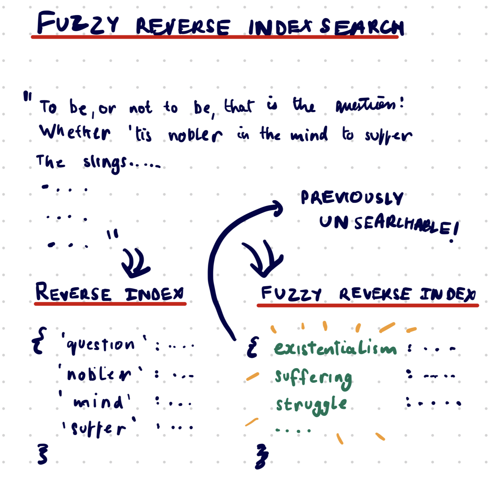

# Fuzzy reverse index search



What if we took existing rigid computer science concepts, and applied deep learning techniques to make them *fuzzy*? I wanted to try that with reverse indexes. Instead of a reverse index with keywords, I wanted to see if I could create a reverse index of *fuzzy concepts*. 

This was vaguely inspired by the [Memwalker](https://arxiv.org/pdf/2310.05029.pdf) paper. 

(This is just me documenting my explorations so far. NOT a super clean or well documented repo! The main code is in main.py but it's pretty messy. Try forking it on replit to experiment.)


## What is this?

Take this paragraph from some data, for example:

> Let's start with a distinction that should be obvious but is often overlooked: not every newly founded company is a startup. Millions of companies are started every year in the US. Only a tiny fraction are startups. Most are service businesses — restaurants, barbershops, plumbers, and so on. These are not startups, except in a few unusual cases. A barbershop isn't designed to grow fast. Whereas a search engine, for example, is.


while a reverse index of the data would look something like this:

```
{
  distinction: [2, 4, ...]
  startup:[0,2,3,5, ...]
}

```

we can extract more *conceptual* information from this paragraph using a fuzzy index. Concepts that appear in this are

```
- obvious but overlooked things about startups
- startups vs normal companies
```

Using LLMs, we can enhance the plaintext content with extra context, that can then help search.


## Why is this useful?

Possible ways this can help are:

1. Reduce the time to search. Instead of checking cosine similarity against each chunk of data, you can almost treat the fuzzy reverse index as a hash map. You can get the most similar concepts, and then vector compare on only the small set of indices in them, as opposed to all of them
2. Increase search accuracy. It could also be possible to *add the concepts* to the chunks before vectorising them, which could make their vectors more specific
3. Allow for new kinds of queries. Instead of simply searching by keyword, or by a vectorised query, this allows for searching by 'concept'. These concepts could be tuned to certain usecases, and have information that wouldn't appear in the actual searchable text. E.g. if you're looking specifically for 'distinctions' in data (not the greatest example, but this is a new way of thinking about what is searchable), you could get your concepts to highlight those specifically.

In a way, this is a mix between operating in text space and vector space. Instead of just keywords (text space), we're indexing on concepts (vectors) represented as text (projected into text space).


## Future explorations

Future experiments, which I may or may not get to:
- what kind of data is this good at? Likely not very keyword searchable data, but more idea dense data.
- what usecases can you get an LLM to *reason* and add context with? Specifically in things that can't be figured out algorithmically (keywords, sentiment etc.) but rather are fuzzier. One thing I've tried is 'difficulty' (of recipes, questions, etc.)
- need to run some tests. Keyword vs vector vs concept enhanced etc. and see performance in terms of speed and ranking across various data.

